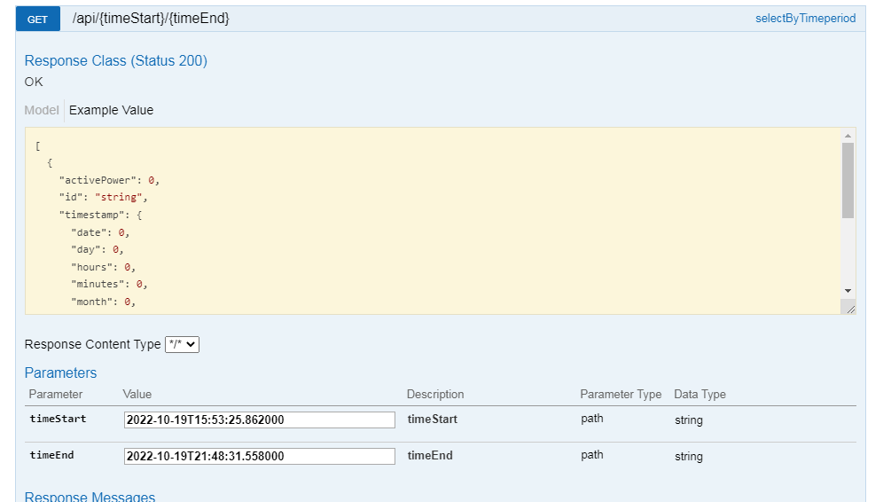
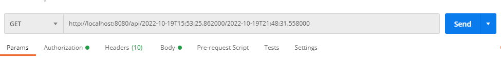

# Backend challenge
Description:
Energy assets (PV, Wind, Battery) are scattered on the field. They are producing large amount of data
that should be send to the central database for the purpose of further analyse and real-time operation. 

## DB setup

 Restore database using:
``` 
psql baza < PostgreSQL___postgres_localhost-2022_10_21_00_53_58-dump.sql 
```
Or create new database using:
```
CREATE DATABASE baza;

CREATE TABLE energy
(
    id uuid NOT NULL,
    "timestamp" timestamp without time zone NOT NULL,
    voltage numeric NOT NULL,
    activepower numeric NOT NULL
); 
```

## API's available on this app

This app uses http://localhost:8080/

1. GET /api
    * Fetches all energy assets that are saved in the database
    
2. GET /api/{id}
    * Fetches just one energy asset based on id
    
3. GET /api/{timeStart}/{timeEnd}
    * Gets all energy asset timeseries data (EnergyAssetTimeseries) on the provided time-period
    
4. GET /api/latestTimestamp
    * Gets the latest energy asset timepoint (EnergyAssetTimeseries)
    
5. PUT /api/{id}
    * Updates chosen energy asset timepoint from database
    
6. DELETE /api/{id}
    * Deletes chosen energy asset timepoint from database
    
7. POST /api
    * Adds energy asset data to the database every 30 seconds
    
## Testing the app

### Testing with swagger

On: http://localhost:8080/swagger-ui.html#/energy45asset45controller

Example of testing:
GET /api/{timeStart}/{timeEnd} in swagger



### Testing with postman
Example of testing:
GET /api/{timeStart}/{timeEnd} in postman


Note: Be careful to write correct timestamp string
       


